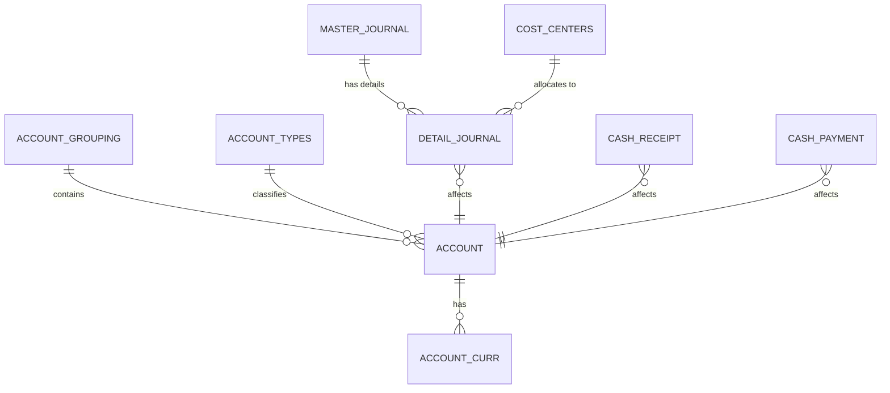
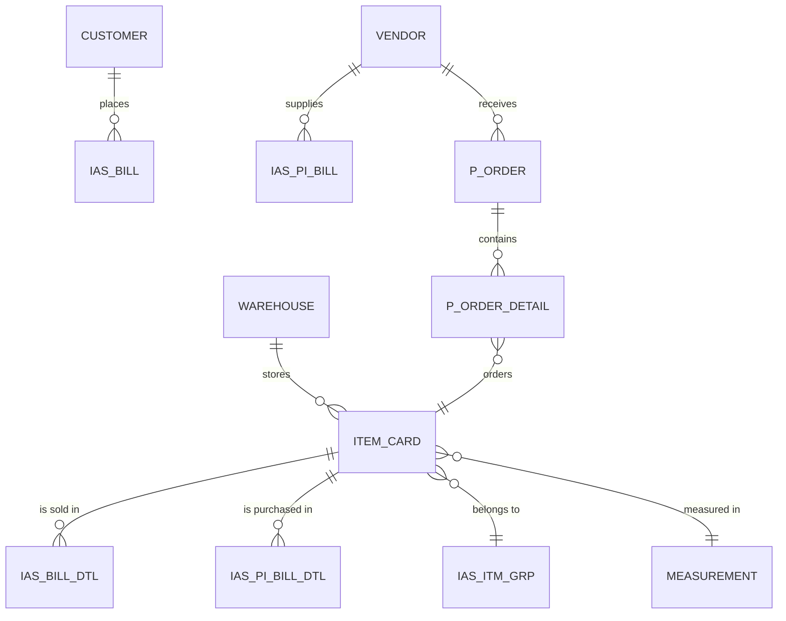

# خريطة علاقات قاعدة بيانات نظام ERP الشاملة

## مقدمة

هذه الوثيقة تقدم خريطة شاملة لعلاقات قاعدة بيانات نظام ERP بناءً على تحليل الجداول والعلاقات المستخرجة من ملفات SQL الأصلية. تحتوي قاعدة البيانات على 876 جدول و1265 علاقة، مقسمة إلى مجموعات وظيفية مختلفة تمثل مختلف وحدات النظام.

## المجموعات الوظيفية الرئيسية

قاعدة البيانات مقسمة إلى المجموعات الوظيفية التالية:

1. **الحسابات والدفتر العام**: تشمل الحسابات والمعاملات المالية والميزانيات
2. **النقدية والبنوك والصناديق**: تتعامل مع إدارة النقد والمعاملات البنكية 
3. **المخزون والمستودعات**: تدير المخزون والمستودعات والأصناف
4. **المبيعات والعملاء ونقاط البيع**: تتعامل مع فواتير المبيعات وإدارة العملاء
5. **المشتريات والموردين**: تدير فواتير المشتريات وطلبات الشراء والموردين
6. **الضمانات والكفالات**: تتعامل مع إدارة الضمانات والكفالات
7. **الموارد البشرية والرواتب**: تدير بيانات الموظفين والرواتب
8. **المشاريع والعقود**: تتعامل مع إدارة المشاريع والعقود
9. **النظام والأمن والصلاحيات**: تدير المستخدمين والصلاحيات وإعدادات النظام

## الجداول المركزية (الأكثر ارتباطًا)

هذه هي الجداول الأكثر أهمية في النظام بناءً على عدد العلاقات المرتبطة بها:

| الجدول | العلاقات الواردة | العلاقات الصادرة | المجموع | الوصف |
|--------|----------------|-----------------|--------|--------|
| IAS_ACTVTY | 113 | 1 | 114 | جدول الأنشطة (مركزي للنظام) |
| COST_CENTERS | 96 | 2 | 98 | مراكز التكلفة |
| IAS_CURRENCY | 92 | 1 | 93 | العملات |
| ITEM_CARD | 88 | 3 | 91 | بطاقة الصنف |
| S_EMP | 69 | 16 | 85 | بيانات الموظفين |
| VENDOR | 51 | 14 | 65 | الموردين |
| CUSTOMER | 48 | 8 | 56 | العملاء |
| IAS_USR | 48 | 4 | 52 | مستخدمي النظام |
| WAREHOUSE | 45 | 4 | 49 | المستودعات |
| IAS_CST_TYP | 39 | 1 | 40 | أنواع العملاء |

## تحليل هيكل قاعدة البيانات حسب المجموعات الوظيفية

### 1. الحسابات والدفتر العام

#### الجداول الرئيسية:
- **ACCOUNT**: جدول الحسابات الرئيسي
- **ACCOUNT_CURR**: عملات دليل الحسابات
- **ACCOUNT_GROUPING**: مجموعات الحسابات
- **MASTER_JOURNAL**: سندات القيد 
- **DETAIL_JOURNAL**: تفاصيل سندات القيد
- **OPEN_BAL**: الأرصدة الافتتاحية

#### العلاقات الرئيسية:
- تربط ACCOUNT مع ACCOUNT_GROUPING لتصنيف الحسابات
- تربط DETAIL_JOURNAL مع MASTER_JOURNAL لتفاصيل القيود المحاسبية
- تربط MASTER_JOURNAL مع ACCOUNT لتحديد الحسابات المستخدمة في القيود

#### نموذج بيانات مبسط:
```
ACCOUNT_GROUPING (1) --- (n) ACCOUNT (1) --- (n) ACCOUNT_CURR
              |
              |
ACCOUNT_TYPES (1) --- (n) ACCOUNT
              |
              |
MASTER_JOURNAL (1) --- (n) DETAIL_JOURNAL
```

### 2. النقدية والبنوك والصناديق

#### الجداول الرئيسية:
- **CASH_RECEIPT**: سندات القبض
- **CASH_PAYMENT**: سندات الصرف
- **BANK_CHEQUE**: الشيكات
- **IAS_BANK**: البنوك
- **IAS_CASH**: الصناديق

#### العلاقات الرئيسية:
- تربط CASH_RECEIPT و CASH_PAYMENT مع ACCOUNT لتسجيل المعاملات المالية
- تربط BANK_CHEQUE مع IAS_BANK لتحديد البنك المسحوب عليه الشيك

### 3. المخزون والمستودعات

#### الجداول الرئيسية:
- **ITEM_CARD**: بطاقة الصنف
- **WAREHOUSE**: المستودعات
- **ITEM_COST**: تكلفة الأصناف
- **MEASUREMENT**: وحدات القياس
- **IAS_ITM_GRP**: مجموعات الأصناف

#### العلاقات الرئيسية:
- تربط ITEM_CARD مع IAS_ITM_GRP لتصنيف الأصناف
- تربط ITEM_CARD مع MEASUREMENT لتحديد وحدات القياس
- تربط ITEM_COST مع ITEM_CARD لتحديد تكلفة الصنف

### 4. المبيعات والعملاء ونقاط البيع

#### الجداول الرئيسية:
- **CUSTOMER**: العملاء
- **IAS_BILL**: فواتير المبيعات
- **SALES_RETURN**: مرتجعات المبيعات
- **IAS_RT_BILL**: إدارة نقاط البيع
- **STN_BILL_DTL**: تفاصيل فواتير نقاط البيع

#### العلاقات الرئيسية:
- تربط IAS_BILL مع CUSTOMER لتحديد العميل
- تربط IAS_BILL مع ITEM_CARD لتحديد الأصناف المباعة
- تربط SALES_RETURN مع IAS_BILL لتتبع المرتجعات

### 5. المشتريات والموردين

#### الجداول الرئيسية:
- **VENDOR**: الموردين
- **IAS_PI_BILL**: فواتير المشتريات
- **P_ORDER**: طلبات الشراء
- **P_REQUEST**: طلبات الشراء الداخلية
- **GRN_MASTER**: استلام البضائع

#### العلاقات الرئيسية:
- تربط IAS_PI_BILL مع VENDOR لتحديد المورد
- تربط P_ORDER مع VENDOR لتحديد المورد
- تربط GRN_MASTER مع P_ORDER لتتبع استلام البضائع

### 6. الموارد البشرية والرواتب

#### الجداول الرئيسية:
- **S_EMP**: بيانات الموظفين
- **HRS_SAL**: الرواتب
- **HRS_VAC_TYP**: أنواع الإجازات
- **HRS_EMP_VAC**: إجازات الموظفين

#### العلاقات الرئيسية:
- تربط HRS_SAL مع S_EMP لتحديد راتب الموظف
- تربط HRS_EMP_VAC مع S_EMP لتتبع إجازات الموظفين

### 7. النظام والأمن والصلاحيات

#### الجداول الرئيسية:
- **IAS_USR**: مستخدمي النظام
- **IAS_GRP**: مجموعات المستخدمين
- **APX_SCR**: شاشات النظام
- **APX_SCR_PRV**: صلاحيات الشاشات

#### العلاقات الرئيسية:
- تربط IAS_USR مع IAS_GRP لتحديد مجموعة المستخدم
- تربط APX_SCR_PRV مع APX_SCR و IAS_USR لتحديد صلاحيات المستخدم على الشاشات

## الملاحظات التحليلية الرئيسية

1. **هيكل متعدد البادئات**: يستخدم النظام العديد من البادئات للجداول مثل IAS_ و STN_ و HRS_ للتمييز بين الوحدات المختلفة.

2. **جداول مركزية قوية**: تتمحور معظم العلاقات حول عدد قليل من الجداول المركزية مثل IAS_ACTVTY و COST_CENTERS و ITEM_CARD.

3. **نمط التفصيل/الرئيسي**: العديد من العلاقات تتبع نمط الجدول الرئيسي/التفاصيل مثل:
   - MASTER_JOURNAL → DETAIL_JOURNAL
   - IAS_BILL → IAS_BILL_DTL
   - P_ORDER → P_ORDER_DETAIL

4. **الأنظمة الفرعية المتكاملة**: تعمل المجموعات الوظيفية معًا من خلال علاقات متبادلة، خاصة مع الحسابات والمخزون.

## تمثيل بصري للعلاقات الرئيسية

### العلاقات المالية الأساسية


### العلاقات الأساسية للمخزون والمبيعات والمشتريات


## الاستنتاجات

1. قاعدة البيانات مصممة لنظام ERP شامل يغطي جميع العمليات التجارية الأساسية.

2. الهيكل يعكس تقسيمًا وظيفيًا واضحًا مع الحفاظ على التكامل من خلال الجداول المركزية.

3. النظام يتبع نمط تصميم أحادي المركز مع IAS_ACTVTY كجدول محوري يربط معظم العمليات.

4. يستخدم النظام مراكز التكلفة (COST_CENTERS) كمفهوم رئيسي للتتبع المالي والإداري.

5. الترميز والتسمية ينعكس في بادئات الجداول مما يسهل فهم انتماءها للوحدات الوظيفية.

## التوصيات لإدارة قاعدة البيانات

1. توثيق شامل للعلاقات والجداول لتسهيل الصيانة.

2. إنشاء مخططات ERD تفصيلية لكل مجموعة وظيفية.

3. مراجعة الفهارس والقيود للتأكد من أدائها الأمثل.

4. تنظيم استراتيجية النسخ الاحتياطي مع مراعاة حجم قاعدة البيانات الكبير.

5. وضع استراتيجية لتطوير وترقية النظام مع الحفاظ على سلامة العلاقات. 